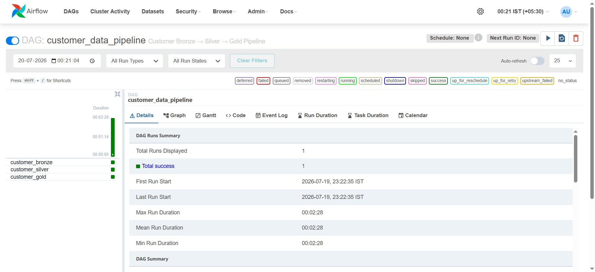
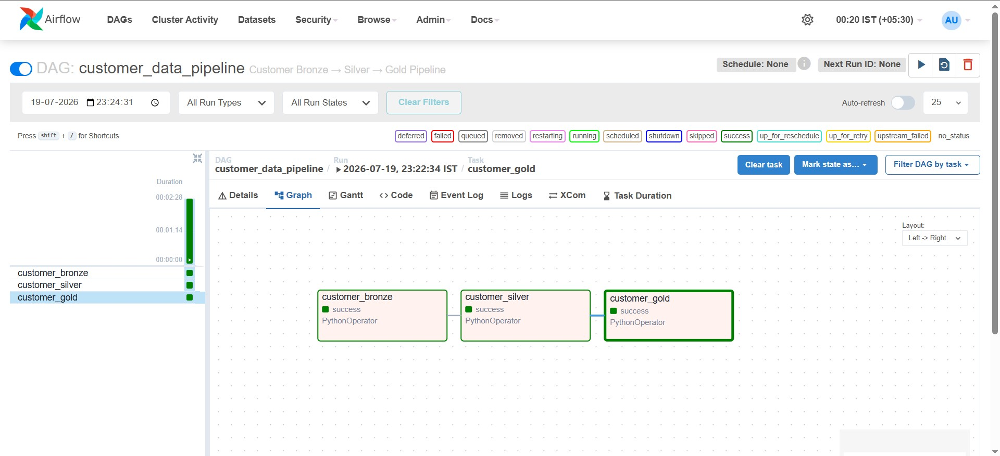
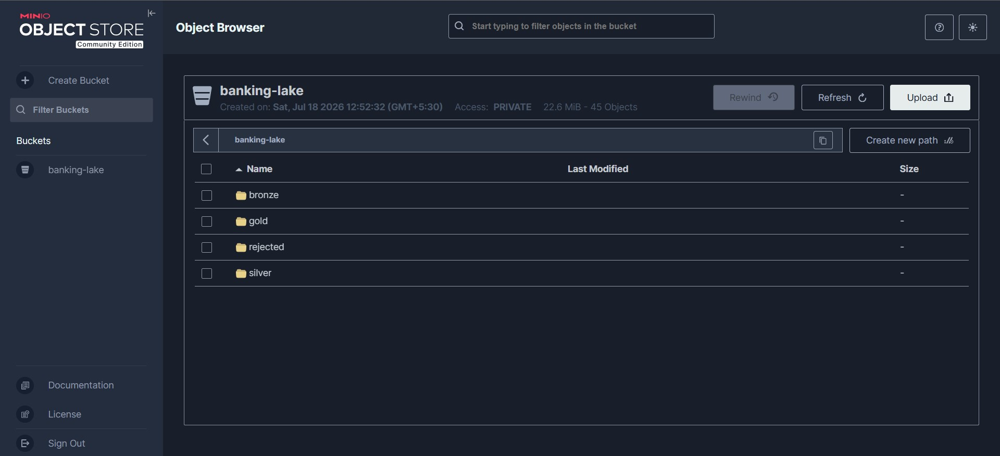
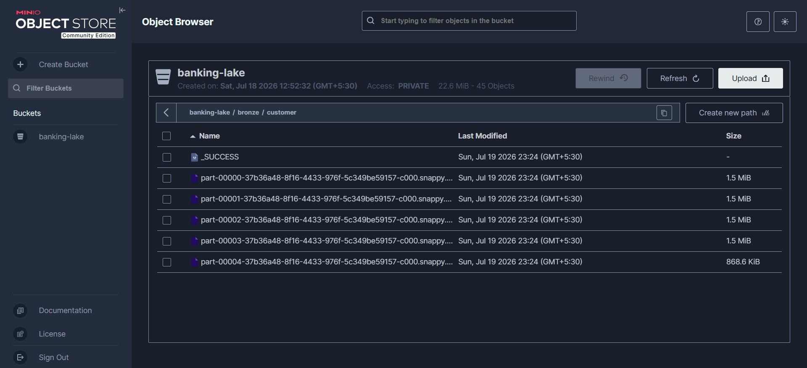
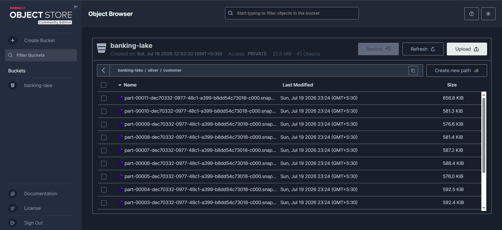
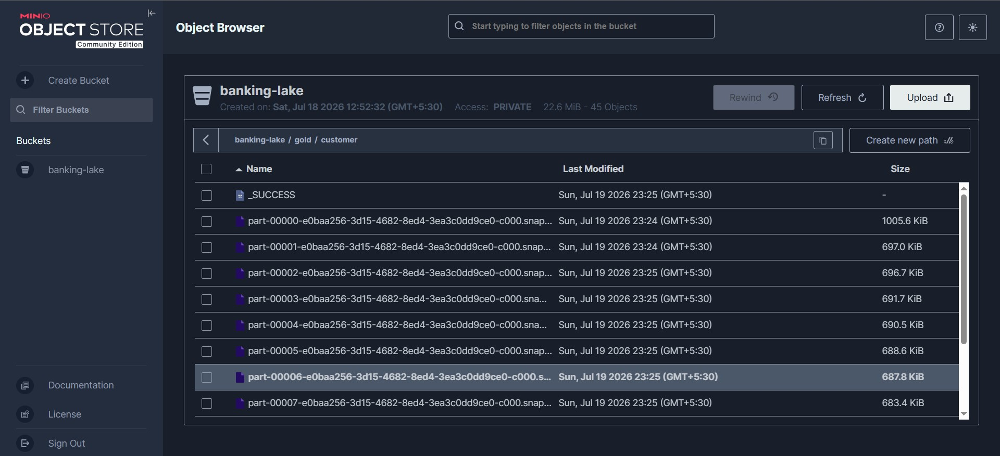
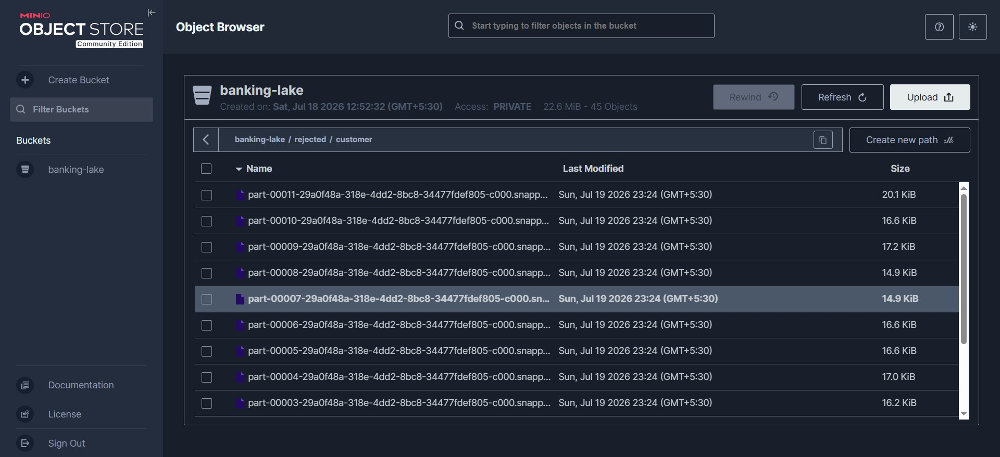
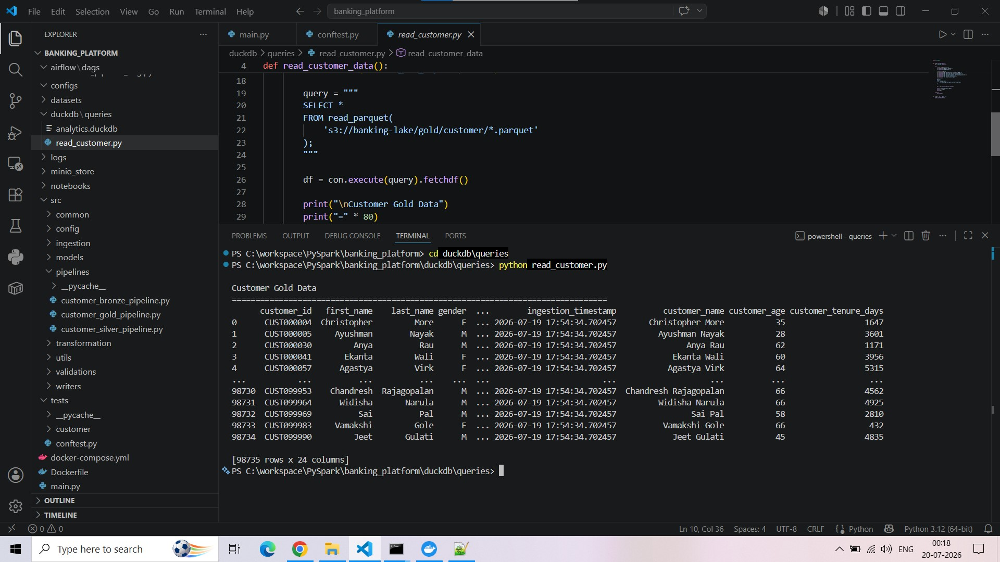
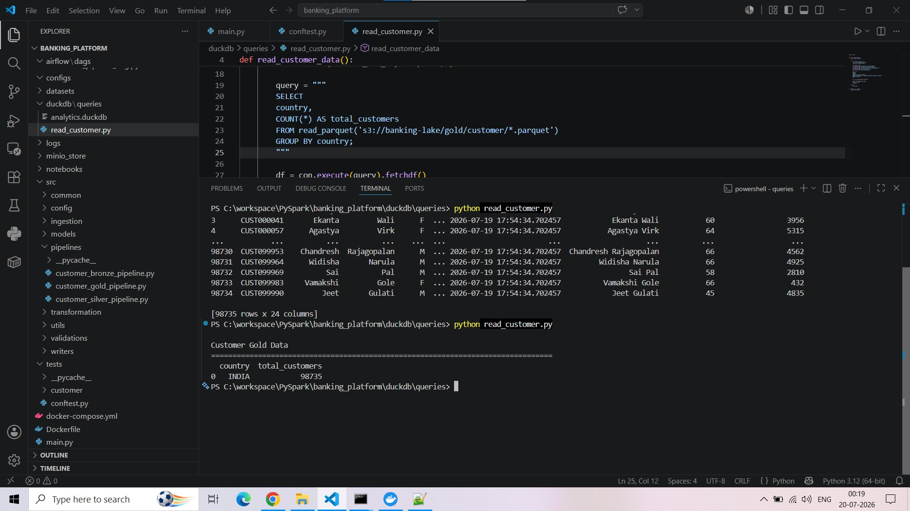
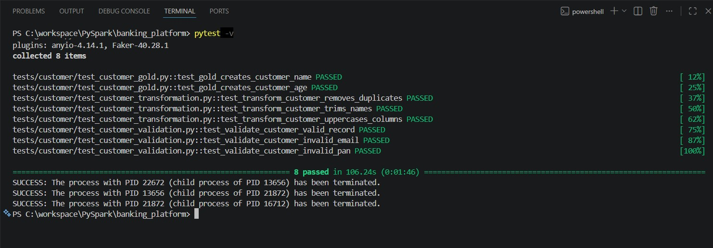

# 🏦 Banking Data Platform

<div align="center">

Production-inspired Banking Data Engineering Platform

Built using PySpark • Apache Airflow • MinIO • DuckDB • Docker

⭐ If you find this project useful, consider giving it a star.

</div>

<div align="center">


A production-inspired **Data Engineering Platform** built using **PySpark**, **Apache Airflow**, **MinIO**, **DuckDB**, and the **Medallion Architecture (Bronze → Silver → Gold)**.

Designed to demonstrate modern data engineering practices including orchestration, distributed processing, data validation, object storage, analytics, and automated testing.

</div>

---

# 📖 Project Overview

Modern organizations continuously ingest large volumes of raw data from multiple sources. Before this data can be consumed by business users, it must pass through several processing stages to ensure quality, consistency, and reliability.

This project simulates a **real-world Banking Data Platform** where customer data flows through multiple layers of processing using the **Medallion Architecture**.

The pipeline demonstrates how enterprise data engineering teams build scalable ETL workflows using modern technologies.

Current implementation includes a complete Customer Data Pipeline.

Future versions will extend the platform to support:

- Transactions
- Loans
- Fixed Deposits
- Credit Cards
- Accounts
- Branches

---

# 🎯 Project Objectives

The primary objectives of this project are:

- Build a modular PySpark ETL pipeline
- Implement the Medallion Architecture
- Store data inside an Object Storage Data Lake
- Perform data validation and reject invalid records
- Orchestrate workflows using Apache Airflow
- Query processed data using DuckDB
- Implement automated unit testing using PyTest
- Design the project using production-style folder organization
- Demonstrate scalable architecture suitable for enterprise data platforms

---

# ✨ Features

## Data Engineering

- End-to-End ETL Pipeline
- Distributed Data Processing using PySpark
- Modular Code Architecture
- Configuration Driven Design
- Production-style Folder Structure

## Data Lake

- Bronze Layer
- Silver Layer
- Gold Layer
- Rejected Records Layer
- MinIO Object Storage

## Data Processing

- Data Cleaning
- Data Standardization
- Duplicate Removal
- Data Validation
- Business Transformations

## Analytics

- DuckDB SQL Queries
- Parquet Query Engine
- Business-ready Gold Layer

## Orchestration

- Apache Airflow DAG
- Sequential Task Execution
- Pipeline Monitoring

## Testing

- Unit Tests using PyTest
- Spark Session Fixtures
- Transformation Tests
- Validation Tests
- Gold Layer Tests

---

# 🌟 Project Highlights

- Production-inspired Data Engineering Project
- Built using PySpark and Apache Airflow
- Implements Medallion Architecture (Bronze → Silver → Gold)
- Object Storage using MinIO
- DuckDB Analytics on Parquet Files
- Modular and Scalable Project Structure
- Automated Unit Testing with PyTest
- Synthetic Banking Dataset


---


# 🏗️ Architecture

```text
                    Source CSV Files
                           │
                           ▼
                  PySpark Ingestion
                           │
                           ▼
                  Bronze Layer (Raw)
                           │
                           ▼
              Validation & Cleaning
                           │
              ┌────────────┴────────────┐
              ▼                         ▼
      Silver Layer               Rejected Layer
      (Validated)               (Invalid Records)
              │
              ▼
      Business Transformations
              │
              ▼
        Gold Layer (Analytics)
              │
              ▼
          DuckDB SQL Queries
              │
              ▼
      Business Insights & Reports
```

---

# 📊 Medallion Architecture

This project follows the Medallion Architecture, a modern approach widely used in enterprise data engineering platforms.

## 🥉 Bronze Layer

Purpose:

- Store raw ingested data
- Preserve original source
- No business transformations
- Historical storage

Contents:

- Raw Customer Dataset

---

## 🥈 Silver Layer

Purpose:

- Data Cleaning
- Data Validation
- Duplicate Removal
- Schema Standardization
- Quality Enforcement

Invalid records are automatically redirected to the Rejected Layer.

---

## 🥇 Gold Layer

Purpose:

- Business Ready Data
- Analytics Optimized
- Reporting Layer
- SQL Query Layer

DuckDB directly queries Gold Layer Parquet files for analytics.


---

# 📂 Project Structure

```text
banking_platform/
│
├── airflow/
│   └── dags/
│
├── datasets/
│   └── source/
│       ├── account/
│       ├── branch/
│       ├── card/
│       ├── customer/
│       ├── fd/
│       ├── loan/
│       └── transaction/
│
├── duckdb/
│   └── queries/
│
├── src/
│   ├── common/
│   ├── config/
│   ├── ingestion/
│   ├── models/
│   ├── pipelines/
│   ├── transformation/
│   ├── validations/
│   ├── writers/
│   └── utils/
│
├── tests/
│   └── customer/
│
├── Dockerfile
├── docker-compose.yml
├── main.py
├── pytest.ini
├── requirements.txt
└── README.md
```

---

# ⚙️ Technology Stack

| Category | Technology |
|-----------|------------|
| Programming Language | Python |
| Data Processing | PySpark |
| Workflow Orchestration | Apache Airflow |
| Containerization | Docker |
| Data Lake | MinIO |
| Query Engine | DuckDB |
| Storage Format | Apache Parquet |
| Testing | PyTest |
| Version Control | Git & GitHub |

---

# 🔄 End-to-End Pipeline Flow

```
CSV Files
      │
      ▼
PySpark Reads Source Data
      │
      ▼
Bronze Layer
      │
      ▼
Validation & Cleaning
      │
      ├──────────────► Rejected Layer
      │
      ▼
Silver Layer
      │
      ▼
Business Transformations
      │
      ▼
Gold Layer
      │
      ▼
DuckDB Analytics
```

---

# 🚀 Getting Started

## Prerequisites

Install the following software before running the project.

- Python 3.11+
- Docker Desktop
- Git
- Apache Airflow (via Docker Compose)
- VS Code (Recommended)

---

# 📥 Clone Repository

```bash
git clone https://github.com/DeepBreath222/banking-data-platform.git

cd banking-data-platform
```

---

# 📦 Install Dependencies

Create a virtual environment.

```bash
python -m venv .venv
```

Activate it.

### Windows

```bash
.venv\Scripts\activate
```

### Linux / macOS

```bash
source .venv/bin/activate
```

Install project dependencies.

```bash
pip install -r requirements.txt
```

---

# 🐳 Start Docker Services

Start Docker Desktop first.

Then execute:

```bash
docker compose up -d
```

Verify all containers are running.

```bash
docker ps
```

Expected containers include:

- Apache Airflow Scheduler
- Apache Airflow Webserver
- Apache Airflow Triggerer
- PostgreSQL
- MinIO

---

# ⚠️ Important Configuration

Before running the project, configure the MinIO endpoint based on where the pipeline will execute.

Open:

```
src/config/storage_config.py
```

---

## ▶ Local Execution (main.py)

If running the pipeline directly from your local machine:

```bash
python main.py
```

Configure:

```python
MINIO_ENDPOINT = "http://localhost:8050"
```

Reason:

The application runs on your host machine and accesses MinIO through the mapped Docker port.

---

## ☁ Apache Airflow Execution

If running using Apache Airflow:

```bash
docker compose up -d

```

Trigger the DAG from the Airflow UI.

Configure:

```python
MINIO_ENDPOINT = "http://minio:9000"
```

Reason:

Airflow runs inside Docker containers.

Containers communicate using Docker's internal network.

Therefore, Airflow cannot access MinIO using `localhost`.

Instead, it must communicate using the Docker service name:

```
minio
```

Changing this endpoint is required before executing the pipeline through Airflow.

---

# ▶ Running the Pipeline

## Option 1 — Local Execution

Execute:

```bash
python main.py
```

Pipeline execution order:

```
Read CSV
      │
      ▼
Bronze
      │
      ▼
Silver
      │
      ▼
Gold
```

---

## Option 2 — Airflow Execution

Start services.

```bash
docker compose up -d
```

Open Airflow.

```
http://localhost:8080
```

Login using your configured credentials.

Locate the DAG.

Enable the DAG.

Trigger execution.

Monitor execution from:

- Grid View
- Graph View
- Task Logs

Once completed, all processed data will be available inside MinIO.

---

---

# 📊 Data Quality Pipeline

The platform enforces data quality by validating records before they reach the analytics layer.

## Validation Rules

The Customer pipeline currently validates:

- Mandatory fields
- Duplicate records
- Email format
- PAN format
- Data type consistency
- Null values
- Business rules

Invalid records are automatically redirected to the **Rejected Layer**, allowing the main pipeline to continue processing valid records without interruption.

---

# 🗃️ Data Lake Structure

```
banking-lake/
│
├── bronze/
│   └── customer/
│
├── silver/
│   └── customer/
│
├── gold/
│   └── customer/
│
└── rejected/
    └── customer/
```

Each layer serves a specific purpose:

| Layer | Description |
|--------|-------------|
| Bronze | Raw ingested data |
| Silver | Cleaned and validated data |
| Gold | Business-ready analytics data |
| Rejected | Invalid records for auditing |

---

# 📈 DuckDB Analytics

DuckDB is used as the analytical query engine over the Gold Layer Parquet files stored inside MinIO.

Unlike traditional databases, DuckDB queries the Parquet files directly without requiring data to be imported.

Example:

```sql
SELECT *
FROM read_parquet(
's3://banking-lake/gold/customer/*.parquet'
);
```

Example Business Query:

```sql
SELECT
    country,
    COUNT(*) AS total_customers
FROM read_parquet(
's3://banking-lake/gold/customer/*.parquet'
)
GROUP BY country
ORDER BY total_customers DESC;
```

---

# 📸 Project Screenshots

## Apache Airflow

### DAG Details



---

### DAG Graph



---

# 🗄️ MinIO Object Storage

### Banking Lake



---

### Bronze Layer



---

### Silver Layer



---

### Gold Layer



---

### Rejected Layer



---

# 🦆 DuckDB

### Customer Gold Data



---

### Business Analytics Query



---

# 🧪 Unit Testing

The project includes automated unit tests using **PyTest**.

Current coverage includes:

- Customer Transformation Tests
- Validation Tests
- Gold Layer Tests
- Spark Session Fixtures

Run tests using:

```bash
pytest -v
```

Current Status:

```
============================= test session starts =============================

8 passed

============================== 8 passed ======================================
```

### Test Results



---

# 📁 Datasets

This repository contains **synthetic banking datasets** created exclusively for learning and demonstration purposes.

Included datasets:

- Customer
- Account
- Branch
- Card
- Loan
- Fixed Deposit
- Transaction

Only the **Customer** pipeline is currently implemented.

The remaining datasets are included to demonstrate how the platform can be extended to support additional banking domains.

---

# 🗺️ Roadmap

## ✅ Version 1

- Customer Pipeline
- PySpark ETL
- Bronze Layer
- Silver Layer
- Gold Layer
- Rejected Layer
- Apache Airflow
- MinIO
- DuckDB
- Docker
- Unit Testing

---

## 🚧 Upcoming Versions

- Transaction Pipeline
- Loan Pipeline
- Fixed Deposit Pipeline
- Credit Card Pipeline
- Account Pipeline
- Branch Pipeline

The architecture has been designed to support multiple banking entities. Future releases will implement additional pipelines following the same Bronze → Silver → Gold processing pattern.


# 🛠️ Troubleshooting

## Airflow Cannot Read MinIO

Verify the endpoint configured inside:

```
src/config/storage_config.py
```

### Local Execution

```python
MINIO_ENDPOINT = "http://localhost:8050"
```

### Airflow Execution

```python
MINIO_ENDPOINT = "http://minio:9000"
```

This is the most common configuration issue because Airflow executes inside Docker while `main.py` executes on the host machine.

---

## Docker Containers Not Running

Verify:

```bash
docker ps
```

Restart services:

```bash
docker compose down

docker compose up -d
```

---

## Unit Tests Failing

Run:

```bash
pytest -v
```

Ensure all project dependencies have been installed.

---

# 🤝 Contributing

Contributions, suggestions, and improvements are welcome.

Feel free to fork the repository, create a feature branch, and submit a pull request.

---

# 📄 License

This project is released under the MIT License.

You are free to use, modify, and distribute it for learning and educational purposes.

---

# 👨‍💻 Author

**Soma Vishal**

Data Engineer | PySpark | Apache Airflow | DuckDB | Docker | Python

GitHub:
https://github.com/VishalSoma2229

---

<div align="center">

### ⭐ If you like this project, please give it a Star!

Thank you for visiting this repository.

Happy Coding! 🚀

</div>