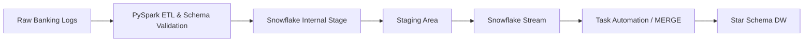
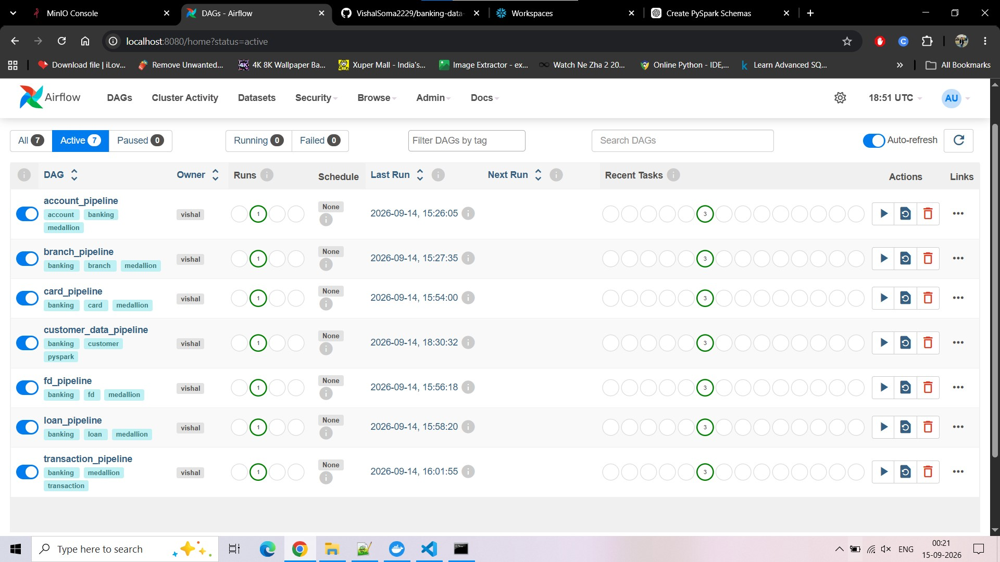
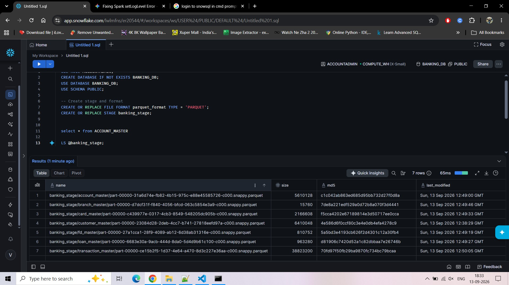
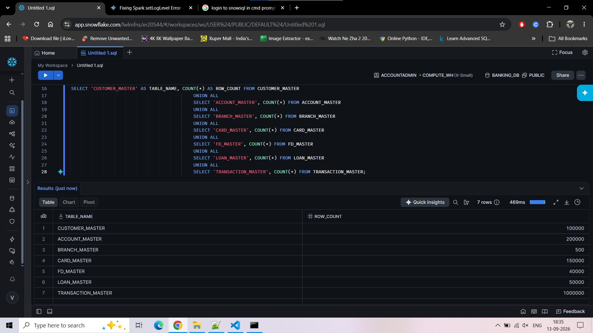

# 🏦 Banking Data Platform

<div align="center">

## Production-Inspired End-to-End Banking Data Engineering Platform

**PySpark • Apache Airflow • MinIO • Duck-UI • Snowflake • Docker**

A modular banking data platform demonstrating **data ingestion, distributed processing, data quality, orchestration, object storage, SQL analytics, and cloud data warehousing** through a production-inspired architecture.

⭐ **If you find this project useful, consider giving it a star.**

</div>

<p align="center">
  
  
  
  
  
  
  
</p>

---

# 📖 Project Overview

Modern banking systems generate data across multiple business domains such as customers, accounts, cards, loans, fixed deposits, branches, and transactions.

This project simulates a **real-world Banking Data Platform** where source data is ingested and processed through a **Medallion Architecture** using PySpark.

The platform combines:

- ⚡ **PySpark** for distributed data processing
- 🔄 **Apache Airflow** for workflow orchestration
- 🪣 **MinIO** as an S3-compatible data lake
- 🦆 **Duck-UI** for interactive SQL analytics
- ❄️ **Snowflake** for cloud data warehousing
- 🐳 **Docker** for reproducible infrastructure

The design separates **orchestration, processing, storage, validation, transformation, and analytics**, making the platform modular and easier to extend.

---

# 🎯 Project Objectives

- Build a modular PySpark ETL platform
- Implement the **Bronze → Silver → Gold** Medallion Architecture
- Process multiple banking domains
- Store processed data as **Apache Parquet** in MinIO
- Implement validation and rejected-record handling
- Orchestrate domain pipelines using Apache Airflow
- Query and explore Gold-layer Parquet using **Duck-UI**
- Load banking data into Snowflake
- Build an analytics-oriented Snowflake star schema
- Run the same processing platform in **containerized or local mode**
- Maintain a clean, production-inspired project structure

---

# ✨ Key Features

<table>
<tr>
<td width="50%">

### 🧱 Data Engineering

- End-to-end PySpark ETL
- Distributed data processing
- Explicit dataset schemas
- Modular pipeline components
- Configuration-driven design
- Domain-wise processing

</td>
<td width="50%">

### 🗃️ Data Lake

- Bronze Layer
- Silver Layer
- Gold Layer
- Rejected Layer
- S3-compatible MinIO storage
- Apache Parquet format

</td>
</tr>

<tr>
<td>

### 🔄 Orchestration

- Separate Airflow DAG per domain
- Bronze → Silver → Gold dependencies
- Scheduling and triggering
- Task-level monitoring
- Execution logs

</td>
<td>

### 📊 Analytics

- Duck-UI
- Interactive SQL queries
- Direct Parquet exploration
- Gold-layer analytics
- Business-ready datasets

</td>
</tr>

<tr>
<td>

### ❄️ Snowflake

- Snowflake database setup
- Internal staging
- Parquet ingestion
- `COPY INTO`
- Raw banking tables
- Star-schema analytics
- Advanced Snowflake features

</td>
<td>

### 🐳 Infrastructure

- Docker Compose
- Airflow services
- PostgreSQL
- MinIO
- Duck-UI
- Containerized execution
- Local execution support

</td>
</tr>
</table>

---

# 🏗️ Architecture

```text
                         ┌─────────────────────────┐
                         │      Source Data        │
                         │                         │
                         │  CSV Banking Datasets   │
                         │  Future REST APIs       │
                         └────────────┬────────────┘
                                      │
                                      ▼
                         ┌─────────────────────────┐
                         │        PySpark          │
                         │       Ingestion         │
                         └────────────┬────────────┘
                                      │
                                      ▼
                    ┌──────────────────────────────────┐
                    │        🥉 BRONZE - MINIO         │
                    │        Raw Parquet Data           │
                    └────────────────┬─────────────────┘
                                     │
                                     ▼
                    ┌──────────────────────────────────┐
                    │     Validation & Cleaning        │
                    └───────────────┬──────────────────┘
                                    │
                         ┌──────────┴──────────┐
                         │                     │
                         ▼                     ▼
                ┌────────────────┐    ┌────────────────┐
                │ 🥈 SILVER      │    │   REJECTED     │
                │ Validated Data │    │ Invalid Records│
                └───────┬────────┘    └────────────────┘
                        │
                        ▼
                ┌────────────────────┐
                │ Business           │
                │ Transformations    │
                └─────────┬──────────┘
                          │
                          ▼
                ┌────────────────────┐
                │ 🥇 GOLD            │
                │ Analytics Ready    │
                └─────────┬──────────┘
                          │
                 ┌────────┴─────────┐
                 │                  │
                 ▼                  ▼
          ┌──────────────┐   ┌────────────────┐
          │   Duck-UI    │   │   Snowflake    │
          │ SQL Analytics│   │ Cloud Warehouse│
          └──────────────┘   └───────┬────────┘
                                     │
                                     ▼
                              ┌───────────────┐
                              │ Star Schema   │
                              │ & Analytics   │
                              └───────────────┘

                 ┌──────────────────────────────┐
                 │       Apache Airflow         │
                 │ Orchestrates domain DAGs     │
                 └──────────────────────────────┘
```

---

# 🥇 Medallion Architecture

The data lake is organized into four logical areas.

### 🥉 Bronze — Raw

Purpose:

- Preserve ingested source data
- Keep the raw landing layer
- Store data before business transformations
- Maintain a reliable replayable source

```text
banking-lake/bronze/
├── account/
├── branch/
├── card/
├── customer/
├── fd/
├── loan/
└── transaction/
```

### 🥈 Silver — Validated

Purpose:

- Clean data
- Standardize data
- Validate records
- Remove duplicates
- Apply quality rules
- Prepare data for business transformations

```text
banking-lake/silver/
├── account/
├── branch/
├── card/
├── customer/
├── fd/
├── loan/
└── transaction/
```

### 🥇 Gold — Analytics

Purpose:

- Business-ready datasets
- Derived business attributes
- Analytics and reporting
- Downstream consumption

```text
banking-lake/gold/
├── account/
├── branch/
├── card/
├── customer/
├── fd/
├── loan/
└── transaction/
```

### ❌ Rejected — Invalid Records

Invalid records are separated from valid data instead of stopping the complete pipeline.

```text
banking-lake/rejected/
├── account/
├── branch/
├── card/
├── customer/
├── fd/
├── loan/
└── transaction/
```

| Layer | Purpose |
|---|---|
| 🥉 Bronze | Raw source data |
| 🥈 Silver | Cleaned and validated data |
| 🥇 Gold | Business-ready analytics data |
| ❌ Rejected | Invalid records retained for auditing |

---

# 🏦 Banking Domains

The platform processes seven banking domains:

| Domain | Description |
|---|---|
| 👤 Customer | Customer master information |
| 🏦 Account | Banking account information |
| 🌳 Branch | Branch master information |
| 💳 Card | Card information |
| 💰 Fixed Deposit | Fixed-deposit information |
| 💵 Loan | Loan information |
| 💸 Transaction | Banking transaction information |

Each domain follows the same fundamental processing pattern:

```text
Source
  ↓
Bronze
  ↓
Silver
  ↓
Gold
```

---

# ⚙️ Airflow Orchestration

Airflow acts as the **orchestration layer**, while the PySpark modules contain the actual processing logic.

There is one DAG for each banking domain:

```text
airflow/dags/
├── customer_pipeline_dag.py
├── account_pipeline_dag.py
├── branch_pipeline_dag.py
├── card_pipeline_dag.py
├── fd_pipeline_dag.py
├── loan_pipeline_dag.py
└── transaction_pipeline_dag.py
```

Each DAG follows:

```text
Bronze Task
     │
     ▼
Silver Task
     │
     ▼
Gold Task
```

### Separation of Responsibilities

```text
Apache Airflow
      │
      ├── Schedule
      ├── Trigger
      ├── Manage dependencies
      ├── Monitor
      └── Show task logs
               │
               ▼
        PySpark Pipelines
               │
               ├── Ingestion
               ├── Validation
               ├── Transformation
               └── Writing
```

This keeps **workflow orchestration separate from data-processing logic**.

---

# 🧩 PySpark Project Structure

```text
src/
├── common/
├── config/
├── ingestion/
├── models/
├── pipelines/
│   ├── customer_bronze_pipeline.py
│   ├── customer_silver_pipeline.py
│   ├── customer_gold_pipeline.py
│   ├── account_pipeline.py
│   ├── branch_pipeline.py
│   ├── card_pipeline.py
│   ├── fd_pipeline.py
│   ├── loan_pipeline.py
│   └── transaction_pipeline.py
├── transformation/
├── validations/
└── writers/
```

The implementation keeps the codebase modular so that adding another banking domain does not require rewriting the platform.

---

# 🧹 Data Quality

The platform validates records before they reach the analytics layer.

Typical validation areas include:

- Mandatory fields
- Null values
- Duplicate records
- Schema/data-type consistency
- Email format
- PAN format
- Domain/business rules

Processing concept:

```text
                 Incoming Records
                        │
                        ▼
                  Data Validation
                        │
               ┌────────┴────────┐
               │                 │
             Valid            Invalid
               │                 │
               ▼                 ▼
            Silver           Rejected
               │
               ▼
              Gold
```

---

# 🪣 MinIO — S3-Compatible Data Lake

MinIO provides the project's local **S3-compatible object storage**.

The data lake contains:

```text
banking-lake/
├── bronze/
├── silver/
├── gold/
└── rejected/
```

Data is stored as **Apache Parquet**, providing an efficient format for Spark processing and analytical querying.

---

# 🔥 Containerized vs Local Execution

A key design feature of this project is that the **same processing code can run in two environments**.

The switch is controlled by the MinIO endpoint in:

```text
src/config/storage_config.py
```

### 🐳 Containerized Execution

When the pipeline runs inside Docker:

```python
MINIO_ENDPOINT = "http://minio:9000"
```

Docker containers communicate with the MinIO service through:

```text
minio:9000
```

### 💻 Local Execution

When the pipeline runs directly on your machine:

```python
MINIO_ENDPOINT = "http://localhost:8050"
```

The host machine reaches the MinIO container through the mapped port.

### ⭐ One Small Configuration Change

**A single change to the endpoint in `storage_config.py` can completely switch the project from containerized execution to local execution.**

```text
                       storage_config.py
                              │
                 ┌────────────┴────────────┐
                 │                         │
                 ▼                         ▼
       http://minio:9000        http://localhost:8050
                 │                         │
                 ▼                         ▼
         🐳 Docker Mode              💻 Local Mode
```

No redesign of the PySpark pipelines is required.

This demonstrates **environment-specific configuration with reusable application logic**.

---

# 🦆 Duck-UI Analytics

**Duck-UI** is used in this project as the interactive SQL interface for exploring the data lake.

The Gold-layer Parquet data can be queried through the SQL interface.

Example:

```sql
SELECT *
FROM read_parquet(
    's3://banking-lake/gold/customer/*.parquet'
)
LIMIT 10;
```

### Example Business Query

```sql
SELECT
    country,
    COUNT(*) AS total_customers
FROM read_parquet(
    's3://banking-lake/gold/customer/*.parquet'
)
GROUP BY country
ORDER BY total_customers DESC;
```

Duck-UI provides a lightweight browser-based environment for **interactive SQL exploration and validation of the Gold layer**.

---

# ❄️ Snowflake Data Warehouse

The project includes an end-to-end **Snowflake data warehouse implementation** for processing high-frequency transactional banking data into an analytics-ready **Star Schema**.

## Key Snowflake Capabilities

### 📥 Scalable Ingestion

PySpark is used to preprocess and validate raw banking transaction data before bulk loading the data into **Snowflake internal stages**.

```text
Raw Banking Data
      │
      ▼
   PySpark
      │
      ├── Schema Validation
      ├── Data Processing
      └── Transformation
      │
      ▼
Snowflake Internal Stage
```

### ⭐ Star Schema Warehouse

The analytics layer models banking data using a dimensional/star-schema approach.

Core objects include:

```text
                    ┌─────────────────────┐
                    │  fact_transactions  │
                    └──────────┬──────────┘
                               │
                 ┌─────────────┴─────────────┐
                 │                           │
                 ▼                           ▼
        ┌─────────────────┐         ┌─────────────────┐
        │  dim_customer   │         │   dim_account   │
        └─────────────────┘         └─────────────────┘
```

Key tables include:

- `fact_transactions`
- `dim_customer`
- `dim_account`

This creates an analytics-ready structure for transactional banking analysis.

### 🔄 Automated CDC

Snowflake **Streams & Tasks** are implemented to support near-real-time incremental processing.

The CDC flow uses:

- Snowflake Streams to capture changes
- Snowflake Tasks for automated execution
- `MERGE` logic for incremental updates
- Automated movement of changed data into the analytics layer

```text
Source / Staging Changes
          │
          ▼
   Snowflake Stream
          │
          ▼
      Snowflake Task
          │
          ▼
    MERGE / Upsert
          │
          ▼
     Star Schema
```

### 🔐 Data Security & Governance

The Snowflake implementation also includes security and governance capabilities:

- **Dynamic Data Masking (DDM)** for protecting sensitive/PII data
- **Role-Based Access Control (RBAC)** for controlled access to data
- Separation of access privileges based on roles

This demonstrates how the warehouse can combine **analytics with enterprise data security and governance**.

---

## 🏗️ Snowflake Architecture

```text
┌──────────────────────┐
│   Raw Banking Logs   │
└──────────┬───────────┘
           │
           ▼
┌────────────────────────────┐
│ PySpark ETL & Schema       │
│ Validation / Processing    │
└────────────┬───────────────┘
             │
             ▼
┌────────────────────────────┐
│ Snowflake Internal Stage   │
└────────────┬───────────────┘
             │
             ▼
┌────────────────────────────┐
│       Staging Area         │
└────────────┬───────────────┘
             │
             ▼
┌────────────────────────────┐
│     Snowflake Stream       │
│   Change Data Capture      │
└────────────┬───────────────┘
             │
             ▼
┌────────────────────────────┐
│ Task Automation / MERGE    │
└────────────┬───────────────┘
             │
             ▼
┌────────────────────────────┐
│      Star Schema DW        │
│                            │
│ fact_transactions          │
│ dim_customer               │
│ dim_account                │
└────────────┬───────────────┘
             │
             ▼
      Analytics / BI
```

### Mermaid Version



---

## 📁 Snowflake Project Structure

```text
snowflake/
├── 01_setup/
├── 02_raw_ingestion/
├── 03_analytics_star_schema/
└── 04_advanced_features/
```

The Snowflake implementation covers:

| Area | Implementation |
|---|---|
| Ingestion | PySpark + Snowflake internal stages |
| Processing | PySpark ETL & schema validation |
| CDC | Snowflake Streams |
| Automation | Snowflake Tasks |
| Incremental Processing | `MERGE` |
| Modeling | Star Schema |
| Fact Table | `fact_transactions` |
| Dimensions | `dim_customer`, `dim_account` |
| Security | Dynamic Data Masking |
| Governance | RBAC |

# 📂 Project Structure

```text
banking_platform/
│
├── .vscode/
│
├── airflow/
│   └── dags/
│       ├── customer_pipeline_dag.py
│       ├── account_pipeline_dag.py
│       ├── branch_pipeline_dag.py
│       ├── card_pipeline_dag.py
│       ├── fd_pipeline_dag.py
│       ├── loan_pipeline_dag.py
│       └── transaction_pipeline_dag.py
│
├── assets/
│   ├── airflow-details.jpg
│   ├── airflow-graph.jpg
│   ├── airflow-pipelines.jpg
│   ├── duckdb-analysis.jpg
│   ├── duckdb-setup.jpg
│   ├── minio-bronze.jpg
│   ├── minio-gold.jpg
│   ├── minio-rejected.jpg
│   ├── minio-root.jpg
│   ├── minio-silver.jpg
│   ├── snowflake-stages.jpg
│   └── snowflake-tables.jpg
│
├── datasets/
│   └── source/
│       ├── account/
│       ├── branch/
│       ├── card/
│       ├── customer/
│       ├── fd/
│       ├── loan/
│       └── transaction/
│
├── duckdb/
│   └── queries/
│
├── minio_store/
│   └── banking-lake/
│       ├── bronze/
│       ├── silver/
│       ├── gold/
│       └── rejected/
│
├── snowflake/
│   ├── 01_setup/
│   ├── 02_raw_ingestion/
│   ├── 03_analytics_star_schema/
│   └── 04_advanced_features/
│
├── src/
│   ├── common/
│   ├── config/
│   ├── ingestion/
│   ├── models/
│   ├── pipelines/
│   ├── transformation/
│   ├── validations/
│   └── writers/
│
├── docker-compose.yml
├── Dockerfile
├── .gitignore
├── main.py
├── requirements.txt
└── README.md
```

> **Note:** `minio_store/` contains local MinIO runtime/object-storage data and should normally remain outside Git tracking. Keep generated storage data and MinIO internal files out of the repository.

---

# 🔄 End-to-End Data Flow

```text
             SOURCE
               │
               ▼
       ┌────────────────┐
       │ Banking CSVs   │
       └───────┬────────┘
               │
               ▼
          🐍 PySpark
               │
               ▼
        🥉 Bronze / MinIO
               │
               ▼
      Validation & Cleaning
               │
        ┌──────┴──────┐
        │             │
        ▼             ▼
   🥈 Silver      ❌ Rejected
        │
        ▼
 Business Transformations
        │
        ▼
   🥇 Gold / MinIO
        │
   ┌────┴─────┐
   │          │
   ▼          ▼
 Duck-UI   Snowflake
   │          │
   │          ▼
   │      Star Schema
   │          │
   └────┬─────┘
        ▼
   Analytics / BI
```

---

# 🐳 Docker Setup

## Prerequisites

Install:

- Python 3.11+
- Docker Desktop
- Git
- VS Code (recommended)

---

## 📥 Clone the Repository

```bash
git clone https://github.com/VishalSoma2229/banking-data-platform.git

cd banking-data-platform
```

---

## 📦 Install Python Dependencies

Create a virtual environment:

```bash
python -m venv .venv
```

### Windows

```bash
.venv\Scripts\activate
```

### Linux / macOS

```bash
source .venv/bin/activate
```

Install dependencies:

```bash
pip install -r requirements.txt
```

---

# ▶️ Start the Containerized Platform

Start Docker Desktop, then:

```bash
docker compose up -d
```

Check services:

```bash
docker compose ps
```

Typical services include:

- Apache Airflow Webserver
- Apache Airflow Scheduler
- Apache Airflow Triggerer
- PostgreSQL
- MinIO
- Duck-UI

### Local Service URLs

| Service | URL |
|---|---|
| Airflow | `http://localhost:8080` |
| MinIO API | `http://localhost:8050` |
| MinIO Console | `http://localhost:8055` |
| Duck-UI | `http://localhost:5522` |

---

# ▶️ Run the Pipelines

## Option 1 — Airflow

Open:

```text
http://localhost:8080
```

Then:

1. Open the required DAG
2. Enable the DAG
3. Trigger the DAG
4. Monitor task execution
5. Inspect task logs
6. Verify the output in MinIO

Example:

```text
account_bronze
      │
      ▼
account_silver
      │
      ▼
account_gold
```

---

## Option 2 — Local Execution

Change the endpoint in:

```text
src/config/storage_config.py
```

to:

```python
MINIO_ENDPOINT = "http://localhost:8050"
```

Then run:

```bash
python main.py
```

The same PySpark processing logic can execute directly on the host machine.

---

# 🖼️ Project Screenshots

All screenshots below are stored in the repository's `assets/` directory and are linked using **relative GitHub paths**, so they render directly on the project README.

## 🔄 Airflow

### DAG Details


### DAG Graph


### All Pipelines



---

## 🦆 Duck-UI

### SQL Analysis


### Duck-UI Setup


---

## 🪣 MinIO

### Root Bucket


### Bronze Layer


### Silver Layer


### Gold Layer


### Rejected Layer


---

## ❄️ Snowflake

### Snowflake Stages



### Snowflake Tables



---

# 🗺️ Roadmap

## ✅ Completed

- [x] Seven banking domains
- [x] Customer pipeline
- [x] Account pipeline
- [x] Branch pipeline
- [x] Card pipeline
- [x] Fixed Deposit pipeline
- [x] Loan pipeline
- [x] Transaction pipeline
- [x] PySpark ETL
- [x] Bronze Layer
- [x] Silver Layer
- [x] Gold Layer
- [x] Rejected Layer
- [x] Apache Airflow orchestration
- [x] Separate DAG per banking domain
- [x] MinIO S3-compatible data lake
- [x] Parquet storage
- [x] Duck-UI analytics
- [x] Docker infrastructure
- [x] Snowflake raw ingestion
- [x] Snowflake analytics/star-schema structure
- [x] Snowflake Streams & Tasks for CDC
- [x] Snowflake MERGE-based incremental processing
- [x] Snowflake Dynamic Data Masking (DDM)
- [x] Snowflake Role-Based Access Control (RBAC)
- [x] Local + containerized execution support

## 🚧 Planned Enhancements

### 🌐 REST API Ingestion

Add external REST APIs as another source:

```text
REST API
   │
   ▼
Python API Ingestion
   │
   ▼
Bronze / MinIO
   │
   ▼
PySpark
   │
   ▼
Silver → Gold
```

Potential capabilities:

- API authentication
- Pagination
- Retry handling
- Rate-limit handling
- Incremental API ingestion
- API-to-data-lake pipelines

### ⚡ Streaming

Introduce real-time transaction/event ingestion:

```text
Banking Events
      │
      ▼
Kafka / Event Hubs / Kinesis
      │
      ▼
Streaming Processing
      │
      ▼
Bronze / Real-Time Layer
      │
      ▼
Silver → Gold
```

Potential technologies:

- Apache Kafka
- Spark Structured Streaming
- Apache Flink
- Azure Event Hubs
- AWS Kinesis

> REST API ingestion and streaming are planned extensions and are **not represented as completed components** of the current implementation.

### ☁️ Cloud Evolution

The local architecture can evolve toward managed cloud services:

```text
MinIO       → Cloud Object Storage
Airflow     → Managed Orchestration
PySpark     → Cloud Spark
Snowflake   → Cloud Data Warehouse
```

---

# 🔐 Security

Do **not** commit credentials to GitHub.

Use environment variables or a local `.env` file:

```text
MINIO_ACCESS_KEY=your_key
MINIO_SECRET_KEY=your_secret
SNOWFLAKE_USER=your_user
SNOWFLAKE_PASSWORD=your_password
```

Make sure `.env` is included in `.gitignore`.

---

# 🛠️ Troubleshooting

## Airflow Cannot Import `src`

If Airflow reports:

```text
ModuleNotFoundError: No module named 'src'
```

make sure the project root is added to the Python path before importing project modules:

```python
import sys
from pathlib import Path

PROJECT_ROOT = Path(__file__).resolve().parents[2]

if str(PROJECT_ROOT) not in sys.path:
    sys.path.insert(0, str(PROJECT_ROOT))
```

---

## Airflow Cannot Access MinIO

Check:

```text
src/config/storage_config.py
```

### Docker

```python
MINIO_ENDPOINT = "http://minio:9000"
```

### Local

```python
MINIO_ENDPOINT = "http://localhost:8050"
```

Remember:

```text
Docker container → minio:9000
Host machine     → localhost:8050
```

---

## Docker Containers Not Running

Check:

```bash
docker compose ps
```

Restart:

```bash
docker compose down

docker compose up -d
```

---

# 📌 Engineering Principles Demonstrated

### Separation of Concerns

```text
Airflow       → Orchestration
PySpark       → Processing
MinIO         → Storage
Duck-UI       → SQL Analytics
Snowflake     → Cloud Warehouse
Config        → Environment-specific settings
```

### Reusable Architecture

Each banking domain follows the same processing pattern, making the platform easier to extend.

### Environment Independence

The storage endpoint is configuration-driven, allowing the same processing code to run inside Docker or directly on the local machine.

### Data Quality Isolation

Invalid records are separated into a Rejected Layer instead of contaminating downstream analytics.

---

# 📄 License

This project is released under the MIT License.

You are free to use, modify and distribute it for learning and educational purposes.

---

# 👨‍💻 Author

**Soma Vishal**

**Data Engineer | PySpark | Apache Airflow | Snowflake | MinIO | Duck-UI | Python**

GitHub:

https://github.com/VishalSoma2229

---

<div align="center">

### ⭐ If you like this project, please give it a Star!

**Thank you for visiting this repository.**

**Happy Coding! 🚀**

</div>
